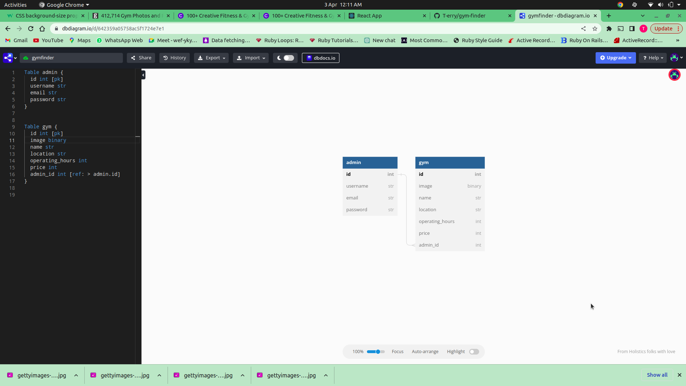

### PHASE 4 CODE CHALLENGE WEEK 1

#### Projects name

    - Gym Finder

#### author information

    The following project are created by:
    - Terry Wachuka
    
####  System dependencies
check GEMFILE

#### Configuration
- rails db:migrate 
- rails server 

#### Database creation
- rails db:migrate 
- rails server 

#### Database initialization
- sqlite in use , add extension on VS code.

#### setup/installation requirements

    - download a zip file under code tab.
    - extract the downloaded zip folder
    - open the folder with VS code
    - Run this command on the terminal to run server:
    console $ rails server
    - Use Postman to view the data through routes in BDD

##### ERD

##### BDD

An admin should;

    ##### BDD

As an admin should;

    - GET /gyms return all gyms in an array

    - GET //:id return the gym matching the id.

    - POST /admins create an admin and associate them to a specific gym

    - DELETE/gyms/:id Delete a gym matching the id.

    - PATCH /gyms/:id return an updated gym object.

    - POST /gyms create a gym instance
    

##### Known Bugs

    The application works perfectly well, no bugs.

#### technologies used

    The following projects used the technologies
    :
    - RUBY, 2.7.4
    - RAILS
    - Active Record

#### Support and Contact information

    Email: terrywachuka10@gmail.com
    

#### License and Copyright Information
Licensed under [MT License] ("https://github.com/T-erry/gym-finder/blob/main/LICENSE.md") 

